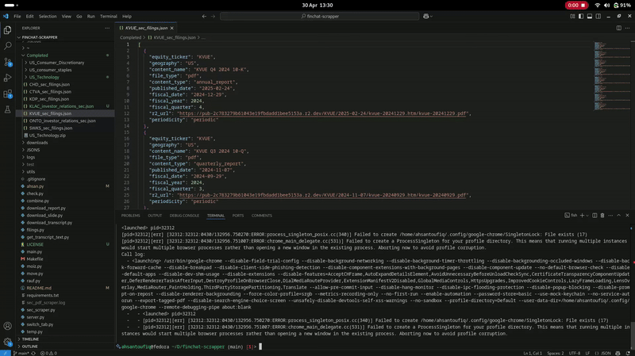

# FinChat Scraper

This project is designed to scrape US equity data such as financial filings, SEC documents, press releases, and more from FinChat. The extracted data is stored in JSON format and pushed to a MongoDB database, enabling seamless data analysis and integration into other systems.

## Key Features

- **Automated Pipeline**: The entire process is automated to handle equities in bulk, eliminating the need for manual labor. The pipeline is robust and ensures data consistency and accuracy.
- **Generic Scraper**: Tested successfully with over 250 equities, proving its ability to work for all equities available on FinChat. The scraper is designed to adapt to changes in the website structure with minimal modifications.
- **Data Storage**: Extracted data is stored in JSON format and seamlessly integrated into MongoDB, making it easy to query and analyze the data for further insights.
- **Scalability**: The scraper is built to handle large volumes of data efficiently, making it suitable for both small-scale and enterprise-level use cases.
- **Error Handling**: Includes mechanisms to handle errors gracefully, ensuring uninterrupted operation even when encountering unexpected issues.

## Demo

Below is a demonstration of the scraper in action:

The demo showcases the scraper's ability to extract data, process it, and store it in MongoDB in real-time.

## License

This project is licensed under the MIT License. See the [LICENSE](LICENSE) file for details.

## Contributions

Contributions are welcome! If you have suggestions for improvements or new features, feel free to open an issue or submit a pull request.

## Contact

For any questions or support, please contact [ahsantoufiq@hotmail.com](mailto:ahsantoufiq@hotmail.com).
